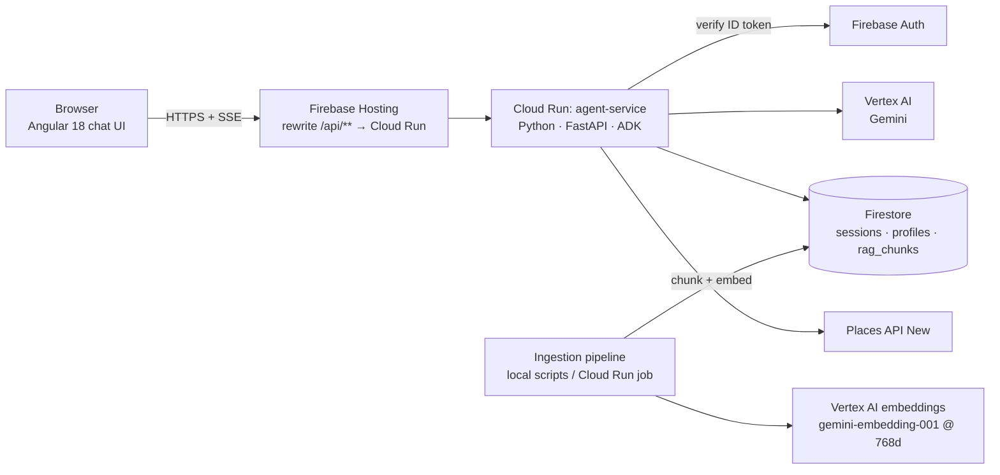

# Autie 2.0 — Target Architecture

Migration of autie.chat (Angular 15 + Dialogflow NLU + Firebase Functions + ChatGPT API +
Google Places legacy) to an agentic architecture.

Current status and open work: [backlog.md](backlog.md).

Decisions locked in (2026-07):

| Area | Decision |
|---|---|
| Audience | Parents / caregivers / educators primarily; autistic individuals secondarily. USA first. |
| Agent framework | **Python + Google ADK** |
| LLM | Gemini via Vertex AI (model-agnostic config; Claude available on Vertex Model Garden as fallback option) |
| Compute | **Cloud Run** (Docker), not Cloud Functions |
| Frontend | **Angular** (continue `autie-2` design; always latest stable Angular, standalone components + signals) |
| Platform base | **Keep Firebase**: Auth, Firestore, Hosting (Hosting rewrites → Cloud Run) |
| RAG | **Custom, Firestore vector search** — no RAG Engine, no Vertex AI Vector Search (cost floors) |
| Scale | Hobby / community nonprofit — optimize for near-zero idle cost |

## System overview



One deployable backend service. No Pub/Sub fan-out, no warm-up intents, no followup-event
chains — the agent loop plus SSE streaming replaces all the timeout workarounds in the old
`firebase/functions` code.

## Components

### 1. Frontend — `autie-2` (Angular 21+)

- Chat UI with **token streaming over SSE** (`fetch` + `ReadableStream`; EventSource can't
  send auth headers). Calm, low-stimulus design; streaming text instead of spinners.
- `@angular/fire` for Auth (anonymous sign-in to start chatting, optional Google sign-in
  to persist history).
- Deployed to Firebase Hosting. `firebase.json` rewrite: `/api/**` → Cloud Run service.
  Same-origin — removes the old CORS `*` hack.
- Renders structured agent outputs (service cards for Places results, citation footnotes
  for RAG answers) via typed message parts in the SSE stream, not by parsing markdown.

### 2. Agent service — Python + ADK on Cloud Run

- **FastAPI** app exposing `POST /api/chat` (SSE response). ADK `Runner` drives the agent;
  wrap with ADK's `get_fast_api_app()` or a thin custom endpoint for control over the
  stream format.
- **Auth middleware**: verify Firebase ID token (`firebase-admin`) on every request;
  user id keys the session.
- **Agent decomposition policy** (decided 2026-07): single root agent with plain
  tools for now. Split a domain into its own agent only when it owns several
  tools + domain rules (e.g. local-services once it has search + details +
  caching + registries). When splitting, expose specialists via **`AgentTool`**
  (root stays the one conversational voice, calls the specialist like a
  function) — reserve **`sub_agents`** transfer for genuinely distinct modes
  (e.g. a social-story generator). Rationale: each extra agent hop doubles
  latency/cost on that path and transfer handoffs make the conversation feel
  robotic if used for simple lookups.
- **Agent layout** (start simple — one root agent, tools, no premature multi-agent):
  - `root_agent` (LlmAgent, Gemini Flash-class model for cost): persona, scope,
    safety-aware system prompt.
  - Tool: `find_local_services(query, location, service_type)` — Places API (New)
    `places:searchText`. NOTE: old code used legacy `maps/api/place/textsearch` — do not
    port that endpoint. The agent validates location + service type conversationally
    before calling (replaces Dialogflow slot-filling).
  - Tool: `search_knowledge_base(question)` — RAG retrieval (below), returns chunks
    with source metadata; agent must cite.
  - Tool: `get_crisis_resources()` — deterministic directory (988, Crisis Text Line,
    Autism Society helpline). Returned verbatim, never paraphrased by the LLM.
- **Sessions**: Firestore-backed. ADK ships `InMemorySessionService` /
  `DatabaseSessionService` (SQLAlchemy) / `VertexAiSessionService`; none is
  Firestore-native, so implement a small `FirestoreSessionService` (subclass
  `BaseSessionService`) — avoids paying for Cloud SQL or Agent Engine. Keep it minimal:
  session doc + events subcollection.
- **Container**: slim Python image, Artifact Registry. Cloud Run settings for hobby scale:
  `min-instances=0`, `concurrency=20+`, `cpu=1`, request timeout 300s, **CPU always
  allocated off** (request-based billing). Revisit `min-instances=1` only if cold starts
  (~2–5 s) annoy in practice.

### 3. Safety layer (first-class, not a prompt afterthought)

Deterministic wrapper around the agent, in the request path:

- **Pre-check** on user input: crisis/self-harm signal → immediately return crisis
  resources (via the deterministic tool) alongside a supportive message; still allow the
  conversation to continue.
- **System-prompt guardrails**: no diagnosis, no medication advice, no ABA-vs-alternatives
  clinical rulings; always recommend professionals for clinical questions; audience-aware
  tone (assume caregiver unless stated).
- **Post-check** (lightweight): scan model output before streaming completes for
  medical-advice patterns; Gemini safety settings on.
- **Untrusted tool output**: Places reviews/summaries and RAG chunks are injected as data,
  clearly delimited in the prompt; instruct the model to treat them as content, not
  instructions (prompt-injection hygiene).
- **Disclosure**: UI shows "Autie is an AI assistant, not a clinician" persistently, not
  only in a first-run modal.

### 4. RAG — custom on Firestore vector search

> Hard implementation guardrails live in [rag-constraints.md](rag-constraints.md) —
> read before writing ingestion/retrieval code.

- **Corpus**: openly licensed / official sources first (CDC, NICE, state education
  agencies, Autism Society, AAP public guidance, open-access papers). Track license per
  source in metadata. Copyrighted books stay out until rights are cleared.
- **Ingestion** (offline scripts, run locally or as a Cloud Run job — not in the serving
  path): parse → heading-aware chunking (~500–800 tokens, overlap ~10%) → embed with
  `gemini-embedding-001` at `output_dimensionality=768` (Firestore vector index caps at
  2048 dims; 768 via Matryoshka truncation is near-lossless and 4× cheaper to store) →
  write to `rag_chunks` collection: `{text, embedding(vector), source_title, source_url,
  license, section, tags[]}`.
- **Retrieval**: embed query (same model/dims) → `find_nearest` (COSINE, k≈6, optional
  equality pre-filter on `tags`) → return chunks + citations to agent.
- **Known limits, accepted at this scale**: no BM25/hybrid (mitigate with `tags`
  pre-filter for acronyms like IEP/ABA); flat KNN scan cost grows with corpus size — fine
  to tens of thousands of chunks; revisit only if the corpus outgrows that.
- **Eval set from day one**: ~50 curated question → expected-source pairs in the repo;
  a pytest-able retrieval check so corpus/chunking changes don't silently regress.

### 5. Data & privacy (USA, nonprofit)

- Firestore collections: `users` (profile, consent flags), `sessions` (agent state),
  `rag_chunks`, `services` (cached Places results — port of the old `firestoreService`).
- Conversations are health-adjacent: **retention policy** (e.g., auto-delete sessions
  after N days unless user opts into history), a **delete-my-data** path, and **no
  conversation text in application logs** (log metadata: latency, tool calls, token
  counts). Not HIPAA-bound, but act close to it — it's cheap to do now and expensive to
  retrofit.
- COPPA note: audience is adults (caregivers), but if autistic minors may sign in,
  keep anonymous mode as the default and collect no birthdate/PII in it.

### 6. Observability & cost

- Cloud Logging with structured logs (session id, tool used, model latency, tokens).
  ADK's built-in tracing → Cloud Trace, optional.
- Budget alert on the GCP project. Expected hobby-scale monthly cost: Cloud Run ≈ $0–5
  (scale-to-zero), Gemini Flash-class ≈ single-digit dollars, Firestore/Hosting/Auth
  within free tier, embeddings one-off pennies. The only real cost lever is the model —
  keep Flash-class as default.

## Repository layout (proposed)

```
Autie/
├── docs/                  # this file, future-integrations.md, ADRs
├── web/                   # Angular app (continue from autie-2)
├── agent/                 # Python ADK service
│   ├── app/
│   │   ├── main.py        # FastAPI + SSE endpoint + auth middleware
│   │   ├── agent.py       # root agent definition
│   │   ├── tools/         # places.py, rag.py, crisis.py
│   │   ├── safety/        # pre/post checks
│   │   └── sessions.py    # FirestoreSessionService
│   ├── ingestion/         # corpus scripts + corpus manifest
│   ├── evals/             # retrieval + conversation eval sets
│   ├── Dockerfile
│   └── pyproject.toml
├── firebase/              # firebase.json (hosting rewrites), rules, indexes
└── .github/workflows/     # deploy: web→Hosting, agent→Cloud Run
```

`autiebot/` and the old `firebase/functions` stay untouched as reference until cutover,
then archive.

## Migration order

1. **Scaffold `agent/`**: FastAPI + ADK root agent (no tools), Firebase token auth, SSE
   streaming, Dockerfile → deploy to Cloud Run behind a Hosting rewrite. *Milestone: can
   chat with Gemini through the new stack end to end.*
2. **Places tool**: port `googlePlacesService.ts` logic to Python against **Places API
   (New)**; reuse the old Firestore `services` caching idea. *Milestone: parity with the
   old app's core feature, minus Dialogflow.*
3. **Angular chat UI** in `web/` (from autie-2 design): streaming chat, anonymous auth,
   service-card rendering.
4. **Safety layer** + crisis tool (before any public link goes out).
5. **RAG**: corpus manifest → ingestion → `search_knowledge_base` tool → citations in UI.
6. **Evals + polish**, then DNS cutover of autie.chat; archive Dialogflow agent and old
   functions.

Steps 1–3 produce a usable replacement; 4 gates public exposure; 5–6 are the enhancement
that motivated the rebuild.
